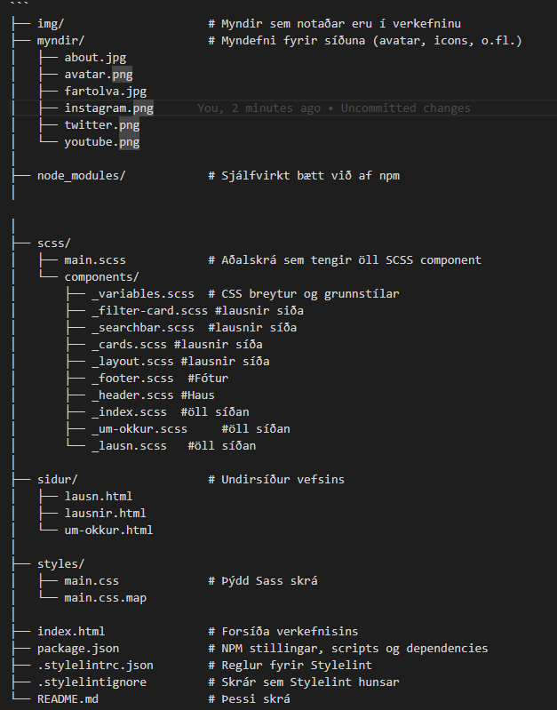

# Hópaverkefni 1

## Keyrsla verkefnis.
Keyrir Sass og fylgist með breytingum:
npm run dev
eða 
npm start

Framleiðslu build fæst með npm run build

### Lint
npm run lint

Til að laga villur sjálfkrafa:
npm run lint:scss:fix

## Repo Skipulag



```
## 👥 Höfundar

| Nafn | HÍ notendanafn | Netfang | GitHub |
|------|-----------------|----------|---------|
| **Einar Atli Guðnason** | eag19 | eag19@hi.is | [@einaratli](https://github.com/einaratli) |
| **Ólafur Breki Guðnason** | obg6 | obg6@hi.is | [@Olibreki](https://github.com/Olibreki) |
